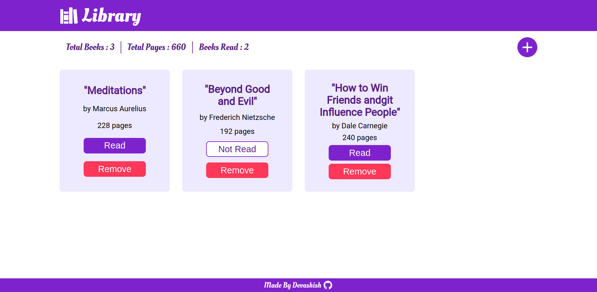

# Library
## About
- Library Project created using HTML, CSS and Vanilla Javascript following TheOdinProject's [curriculum](https://theodinproject.com)
- Live Preview -> [Here](https://devashishchakraborty.github.io/library)
## Screenshots

## What I Learned
- Styling Forms, Grids and Tables
- Media queries
- Pseudo selectors
- Transparent Overlays
- And a Lot more about Javascript DOM and functions